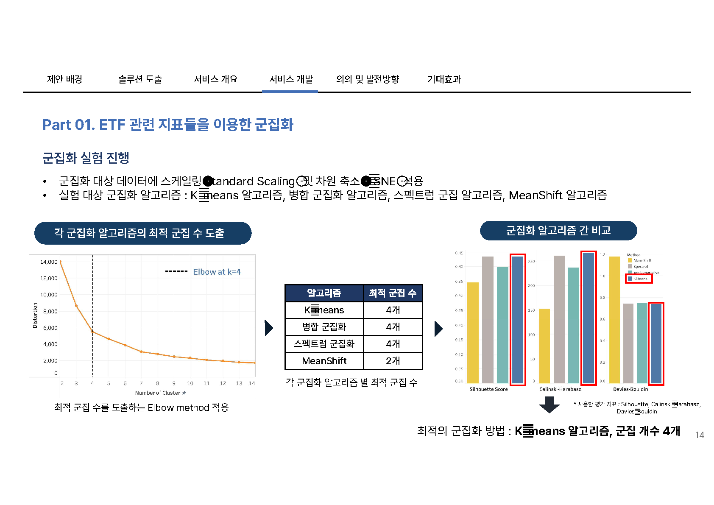
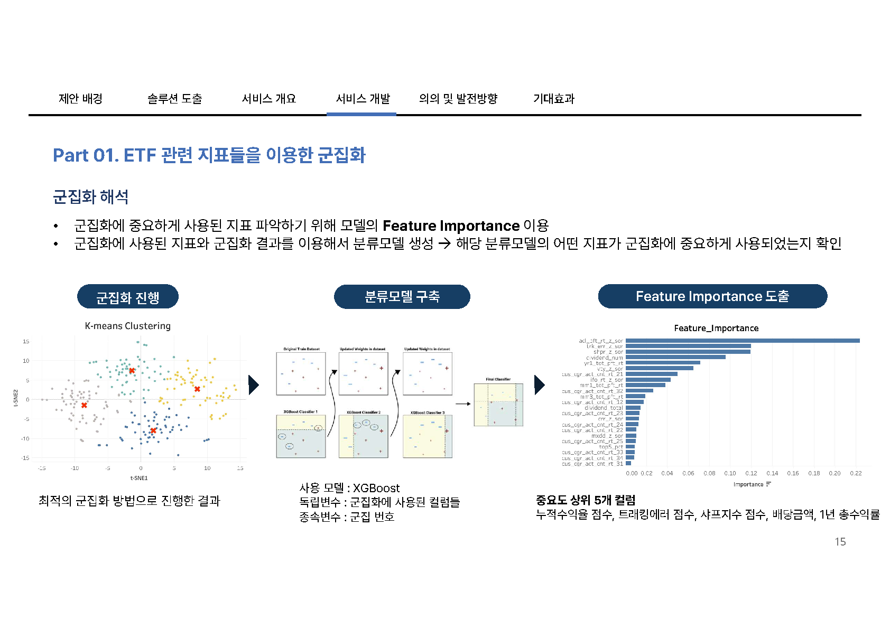
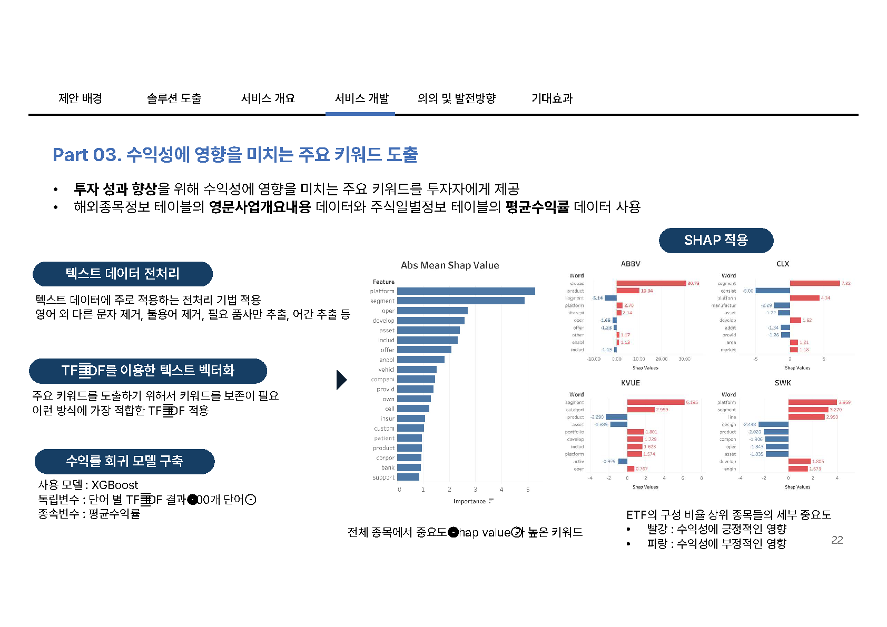

# Gen Pick: ETF 지표 기반 군집화와 생성형 AI ETF 큐레이션

2024 NH투자증권 빅데이터 경진대회 본선 진출 프로젝트입니다. ETF 지표 기반 군집화로 투자자 유형별 대표 ETF를 추천하고, 생성형 AI 요약과 SHAP 키워드 분석으로 ETF 구성 종목 정보를 쉽게 설명하는 서비스 **Gen Pick**을 제안했습니다.

- 기간: 2024.08 - 2024.10
- 성과: 본선 진출
- 역할: 생성형 AI 기반 ETF 요약 설계, 요약 품질 검증 기준 설계, SHAP 키워드 분석
- 사용 기술: Python, scikit-learn, XGBoost, SHAP, TF-IDF, GPT-4o-mini

## Links

- Dacon 예선 코드 공유: [ETF 지표 기반 군집화와 생성형 AI를 이용한 ETF 요약·단어 중요도 큐레이션](https://dacon.io/competitions/official/236348/codeshare/11652)
- 발표자료: [assets/gen-pick-presentation.pdf](assets/gen-pick-presentation.pdf)
- 시연 영상: [assets/gen-pick-demo.mp4](assets/gen-pick-demo.mp4)
- 분석 보고서: [assets/analysis-report.pdf](assets/analysis-report.pdf)

## 1. 프로젝트 개요

| 항목 | 내용 |
| --- | --- |
| 기간 | 2024.08 - 2024.10 |
| 대회 | 2024 NH투자증권 빅데이터 경진대회 |
| 성과 | 본선 진출 |
| 팀 구성 | 3명 |
| 역할 | 생성형 AI 요약 설계, 평가 기준 설계, SHAP 키워드 분석 |
| 목표 | ETF 선택을 돕는 지표 기반 큐레이션 서비스 제안 |
| 결과물 | 군집화 파이프라인, 대표 ETF 추천, 생성형 AI 요약, SHAP 키워드 분석, 발표자료, 시연 영상 |

2024 NH투자증권 빅데이터 경진대회는 NH투자증권이 제공한 금융 데이터를 바탕으로 투자자 경험을 개선할 수 있는 데이터 기반 서비스와 분석 아이디어를 제안하는 대회입니다. 본 프로젝트는 예선을 통과해 본선에 진출했으며, 예선 분석 결과 일부는 Dacon 코드 공유에 공개했습니다.

## 2. 문제 정의

ETF는 수백 개 종목으로 구성될 수 있고, 투자자가 참고할 수 있는 지표도 누적수익률, 샤프지수, 트래킹에러, 최대낙폭, 변동성 등 다양합니다. 이 지표들은 서로 상호작용하며 ETF 성과에 복합적으로 영향을 미치기 때문에 투자자가 ETF의 성격을 직접 해석하기 어렵습니다.

이로 인해 많은 투자자가 지표를 충분히 이해하지 못한 채 과거 수익률 중심으로 ETF를 선택할 수 있습니다. 또한 ETF의 구성 종목이 어떤 사업을 하는지 한눈에 파악하기 어렵기 때문에, ETF가 실제로 어떤 산업과 기술에 노출되어 있는지 이해하기도 쉽지 않습니다.

이 프로젝트는 ETF 선택 과정에서 발생하는 두 가지 문제를 동시에 해결하고자 했습니다.

1. 복잡한 ETF 지표를 투자자 유형과 연결해 이해하기 쉽게 만든다.
2. ETF 구성 종목의 사업 내용을 요약하고, 수익성과 연결되는 키워드를 함께 제공한다.

## 3. 해결 접근

1. ETF 지표 23개를 기반으로 유사 ETF를 군집화합니다.
2. 군집별 대표 ETF를 선정하고, 군집을 설명하는 핵심 지표를 찾습니다.
3. ETF 구성 종목 설명을 생성형 AI로 요약합니다.
4. 사업 개요 텍스트와 수익률을 연결해 SHAP 기반 키워드를 도출합니다.

## 4. 핵심 구현

### 4.1 ETF 지표 기반 군집화

253개 ETF와 23개 지표를 대상으로 군집화를 진행했습니다. 전처리 단계에서는 Standard Scaling으로 지표 스케일을 맞추고, t-SNE로 차원을 축소해 군집 구조를 확인했습니다.

K-means, 병합 군집화, 스펙트럼 군집화, MeanShift 4가지 알고리즘을 비교했습니다. Elbow method로 후보 군집 수를 도출하고, Silhouette, Calinski-Harabasz, Davies-Bouldin 지표를 기준으로 최종 모델을 선택했습니다. 최종적으로 **K-means, 군집 수 4개**가 가장 적합한 방식으로 선정됐습니다.



### 4.2 군집 해석과 대표 ETF 선정

군집화 결과를 해석하기 위해 군집 번호를 종속변수로 하는 XGBoost 분류 모델을 구축하고 Feature Importance를 확인했습니다. 군집 구분에 크게 작용한 지표는 누적수익률 점수, 트래킹에러 점수, 샤프지수 점수, 배당 관련 지표, 1년 총수익률이었습니다.



| Cluster | Interpretation | Representative ETFs |
| --- | --- | --- |
| 0 | 고위험 고수익 추구 | SCHB, SPYX, SPHQ, PBUS, SCHX |
| 1 | 장기 성과 추구 | TECB, ONEQ, FTEC, XLK, XHB |
| 2 | 안정성 중시 보수적 투자자 | VIOV, FDIS, VTWO, SPSM, PEJ |
| 3 | 균형 잡힌 리스크와 높은 배당 추구 | NOBL, IHE, SCHD, SDY, OUSA |

대표 ETF는 각 군집 중심에 가장 가까운 ETF로 정의했습니다. 이를 통해 투자자가 전체 ETF 목록을 직접 비교하지 않고도 각 유형을 대표하는 ETF를 먼저 확인할 수 있도록 설계했습니다.

### 4.3 생성형 AI 기반 ETF 요약

제가 가장 주도적으로 담당한 파트입니다. ETF는 수백 개 구성 종목으로 이루어져 있어 투자자가 ETF의 특성을 한눈에 파악하기 어렵습니다. 이를 해결하기 위해 GPT-4o-mini를 활용해 구성 종목들의 사업 개요를 입력으로 받아 ETF 전체의 특성을 요약하는 기능을 구현했습니다.

구현 과정에서 가장 먼저 마주한 문제는 입력 토큰 제한이었습니다. 구성 종목이 많은 ETF는 모든 종목 설명을 한 번에 입력할 수 없었기 때문에, 구성 비율이 높은 순서대로 최대 30개 종목의 설명만 입력하는 방식을 채택했습니다. ETF의 성격은 비중이 높은 종목들이 크게 결정하기 때문에, 정보량과 입력 가능성 사이의 현실적인 트레이드오프로 판단했습니다.

더 중요한 문제는 생성형 AI 요약 품질을 어떻게 검증할 것인가였습니다. 정답 요약 데이터가 없는 상황에서 출력의 신뢰성을 확보하기 위해 군집 결과와의 정합성을 간접 검증 기준으로 설계했습니다. 동일 군집에 속한 ETF들의 요약 결과가 유사한 키워드와 투자 방향성을 가지는지 확인해, 생성형 AI 출력의 일관성을 점검했습니다.

### 4.4 SHAP 기반 수익성 키워드 도출

ETF 구성 종목의 사업 개요 텍스트와 수익성을 연결하는 분석도 진행했습니다. 영문 사업 개요를 전처리한 뒤 TF-IDF로 벡터화하고, XGBoost 회귀 모델로 평균 수익률을 예측했습니다.

이후 SHAP을 적용해 수익성에 긍정적 또는 부정적으로 영향을 미치는 키워드를 도출했습니다. 단순히 ETF가 어떤 종목으로 구성됐는지 요약하는 데서 끝내지 않고, 어떤 사업 키워드가 수익성과 연결되는지 함께 보여주는 것이 목표였습니다.



## 5. 데이터 처리 및 공개 범위

분석에는 NH투자증권이 제공한 미국 ETF 및 주식 관련 테이블 데이터를 사용했습니다. 주요 데이터는 ETF 점수 정보, ETF 배당 내역, 고객 보유 정보, ETF 구성 종목 정보, 해외 종목 정보 등입니다.

최종 군집화 대상은 필요한 지표를 모두 보유한 253개 ETF였습니다. 공개 저장소에는 데이터 권한과 개인정보 보호를 고려해 원본 테이블 전체, 개인정보성 문서, API 키를 포함하지 않았습니다.

공개 저장소에 포함한 자료는 다음과 같습니다.

- 분석 코드와 노트북
- 군집화 및 SHAP 기반 파생 결과 CSV
- 발표자료 PDF
- 분석 보고서 PDF
- 시연 영상
- 발표자료에서 추출한 원본 슬라이드 이미지

## 6. 데모 및 결과물

| 산출물 | 설명 |
| --- | --- |
| [Dacon 코드 공유](https://dacon.io/competitions/official/236348/codeshare/11652) | 예선 분석 코드 공유 |
| [발표자료](assets/gen-pick-presentation.pdf) | 본선 발표 PDF |
| [시연 영상](assets/gen-pick-demo.mp4) | Gen Pick 서비스 시연 영상 |
| [분석 보고서](assets/analysis-report.pdf) | 프로젝트 분석 보고서 |
| [결과 CSV](results/) | 군집화 성능, Feature Importance, SHAP 키워드 결과 |

## 7. 저장소 구성

```text
.
├── README.md
├── assets/
│   ├── analysis-report.pdf
│   ├── gen-pick-demo.mp4
│   ├── gen-pick-presentation.pdf
│   └── presentation-slide-*.png
├── docs/
│   ├── data-notice.md
│   ├── methodology.md
│   └── portfolio-summary.md
├── notebooks/
│   └── gen_pick_analysis.ipynb
├── results/
│   ├── clustering_model_scores.csv
│   ├── cluster_feature_importance.csv
│   ├── cluster_metric_means.csv
│   ├── keyword_importance_shap.csv
│   └── sample_*_shap_values.csv
├── src/
│   ├── README.md
│   ├── clustering_pipeline.py
│   └── gen_pick_full_pipeline.py
└── requirements.txt
```

## 8. 한계와 배운 점

가장 큰 한계는 생성형 AI 요약 품질을 직접 평가할 정답 레이블이 없었다는 점입니다. 군집 정합성을 활용한 검증은 현실적인 간접 평가였지만, 완전한 정량 평가 지표는 아니었습니다. 또한 실제 투자 성과나 사용자 피드백을 기반으로 추천 결과를 검증하는 단계까지는 수행하지 못했습니다.

이 경험을 통해 생성형 AI를 활용한 프로젝트에서는 모델을 호출하는 것만큼 출력 품질을 어떻게 검증할 것인지가 중요하다는 점을 배웠습니다. 정답이 명확하지 않은 요약 문제에서도 일관성을 확인할 수 있는 기준을 먼저 설계해야 결과물을 서비스에 활용할 수 있습니다.

또한 군집화는 결과를 만드는 것보다 해석하는 과정이 더 중요하다는 점을 배웠습니다. Feature Importance로 어떤 지표가 군집을 나누는 데 핵심적으로 작용했는지 확인하면서, 분석 결과를 투자자 유형과 서비스 기능으로 연결할 수 있었습니다.

## 9. 실행 환경

노트북과 코드는 프로젝트 수행 당시의 실험 흐름을 보존한 자료입니다. 원본 NH투자증권 제공 데이터와 API 키는 공개 저장소에서 제외되어 전체 재실행은 제한됩니다.

주요 라이브러리는 다음과 같습니다.

- Python
- pandas, numpy
- scikit-learn
- XGBoost
- SHAP
- NLTK
- requests
- Azure OpenAI API
