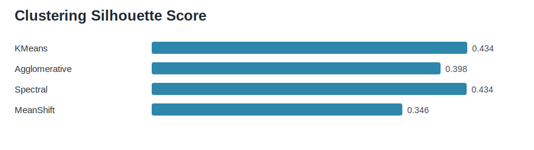
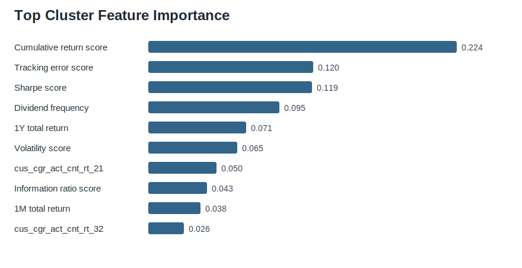
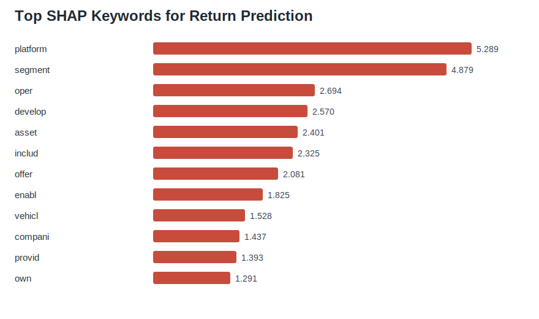

# Gen Pick: ETF Clustering and Generative AI Curation

2024 NH투자증권 빅데이터 경진대회 본선 진출 프로젝트입니다. 미국 ETF 및 주식 관련 테이블 데이터를 활용해 ETF를 지표 기반으로 군집화하고, 생성형 AI로 ETF 구성 종목 설명을 요약하며, SHAP으로 수익성과 연결되는 키워드를 제공하는 ETF 큐레이션 서비스 **Gen Pick**을 제안했습니다.

## Project Overview

ETF는 수백 개 종목으로 구성되고, 투자자가 참고할 수 있는 지표도 누적수익률, 샤프지수, 트래킹에러, 최대낙폭, 변동성 등 다양합니다. 지표들이 서로 상호작용하기 때문에 투자자가 ETF의 성격을 직접 해석하기 어렵고, 결과적으로 과거 수익률만 보고 ETF를 선택하는 문제가 발생할 수 있습니다.

Gen Pick은 이 문제를 세 단계로 해결합니다.

1. ETF 지표 23개를 기반으로 유사 ETF를 군집화합니다.
2. 각 군집의 대표 ETF와 핵심 지표를 제공해 선택 부담을 줄입니다.
3. 생성형 AI 요약과 SHAP 키워드로 ETF 구성 종목의 특성과 수익성 관련 단어를 함께 설명합니다.

## My Contribution

제가 가장 주도적으로 담당한 영역은 **생성형 AI 기반 ETF 설명 요약과 평가 기준 설계**입니다.

- GPT-4o-mini를 활용해 ETF 구성 종목의 사업 개요를 ETF 단위 설명으로 요약했습니다.
- 구성 종목이 많은 ETF의 토큰 제한 문제를 해결하기 위해 구성 비율 상위 30개 종목만 입력하는 방식을 설계했습니다.
- 생성형 AI 요약 품질을 검증하기 위해 같은 군집 ETF의 요약 키워드와 방향성이 일관적인지 확인하는 간접 평가 기준을 설계했습니다.
- 요약 결과만 제공하는 데서 끝내지 않고, TF-IDF, XGBoost, SHAP을 결합해 수익성과 관련된 주요 키워드를 함께 도출했습니다.

## Key Results

> 참고: 아래 차트는 발표자료 원본 이미지를 그대로 가져온 것이 아니라, `results/`에 저장된 프로젝트 결과 CSV를 바탕으로 GitHub 포트폴리오용으로 다시 생성한 시각화입니다.

### Clustering

- 대상: 253개 ETF, 23개 지표
- 전처리: Standard Scaling, t-SNE 차원 축소
- 비교 알고리즘: K-means, Agglomerative Clustering, Spectral Clustering, MeanShift
- 최종 선택: **K-means, 군집 수 4개**
- 평가 지표: Silhouette, Calinski-Harabasz, Davies-Bouldin



### Cluster Interpretation

XGBoost 분류 모델로 군집 결과를 예측하고 Feature Importance를 확인했습니다. 저장된 결과 CSV 기준으로 군집 구분에 크게 작용한 지표는 누적수익률 점수, 트래킹에러 점수, 샤프지수 점수, 배당 주기/횟수, 1년 총수익률이었습니다.



| Cluster | Interpretation | Representative ETFs |
| --- | --- | --- |
| 0 | 고위험 고수익 추구 | SCHB, SPYX, SPHQ, PBUS, SCHX |
| 1 | 장기 성과 추구 | TECB, ONEQ, FTEC, XLK, XHB |
| 2 | 안정성 중시 보수적 투자자 | VIOV, FDIS, VTWO, SPSM, PEJ |
| 3 | 균형 잡힌 리스크와 높은 배당 추구 | NOBL, IHE, SCHD, SDY, OUSA |

### Generative AI ETF Summary

ETF별 구성 종목의 영문 사업 개요와 구성 비율을 입력으로 사용했습니다. 모든 구성 종목 설명을 한 번에 입력하기 어려운 경우, ETF 특성에 가장 큰 영향을 미치는 구성 비율 상위 30개 종목을 기준으로 요약을 생성했습니다.

요약 품질은 완전한 정량 지표 대신 군집 결과와의 정합성을 기준으로 간접 검증했습니다. 동일 군집 ETF들이 유사한 산업 키워드와 투자 성격을 보이는지 확인해 생성형 AI 출력의 일관성을 점검했습니다.

### SHAP Keyword Curation

ETF 구성 종목의 사업 개요 텍스트를 전처리하고 TF-IDF로 벡터화한 뒤, XGBoost 회귀 모델로 평균 수익률을 예측했습니다. 이후 SHAP을 적용해 수익성에 영향을 미치는 키워드를 도출했습니다.



## Repository Structure

```text
.
├── README.md
├── assets/
│   ├── analysis-report.pdf
│   ├── gen-pick-presentation.pdf
│   └── *.svg
├── docs/
│   ├── methodology.md
│   └── portfolio-summary.md
├── notebooks/
│   └── gen_pick_analysis.ipynb
├── results/
│   ├── clustering_model_scores.csv
│   ├── cluster_feature_importance.csv
│   ├── cluster_metric_means.csv
│   ├── keyword_importance_shap.csv
│   └── sample_*_shap_values.csv
├── scripts/
│   └── generate_readme_charts.py
├── src/
│   ├── README.md
│   ├── clustering_pipeline.py
│   └── gen_pick_full_pipeline.py
└── requirements.txt
```

## Data Notice

원본 데이터는 2024 NH투자증권 빅데이터 경진대회에서 제공된 데이터입니다. 공개 저장소에는 원본 테이블 전체를 업로드하지 않고, 프로젝트 설명에 필요한 파생 결과물과 샘플 산출물만 포함했습니다.

## What I Learned

생성형 AI를 활용한 프로젝트에서는 모델을 호출하는 것만큼 출력 품질을 어떻게 검증할 것인지가 중요했습니다. 정답 데이터가 없는 요약 문제에서도 군집 정합성을 활용해 간접 평가 기준을 설계한 경험은 이후 AI 프로젝트에서 평가 설계를 먼저 고민하는 계기가 됐습니다.

또한 군집화는 결과를 만드는 것보다 해석하는 과정이 더 중요하다는 점을 배웠습니다. Feature Importance를 통해 어떤 지표가 군집을 나누는 데 핵심적으로 작용했는지 확인하면서 분석 결과를 서비스 기획으로 연결할 수 있었습니다.
