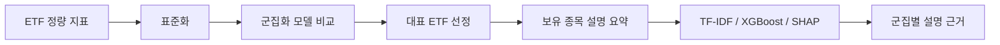
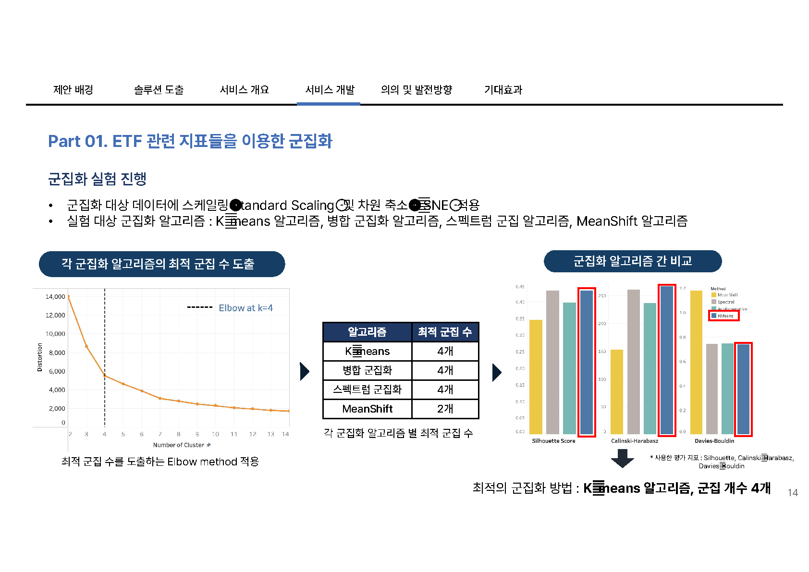

# Gen Pick - ETF 클러스터링과 생성형 AI 요약

<p align="center">2024 NH투자증권 빅데이터 경진대회 · 금융 데이터 분석 · ETF 클러스터링 · 생성형 AI</p>

> ETF를 정량 지표로 군집화하고, 대표 ETF와 보유 종목 설명을 생성형 AI/SHAP 근거로 해석한 금융 데이터 프로덕트입니다.

[](requirements.txt)
[](src/clustering_pipeline.py)
[](docs/methodology.md)
[](docs/portfolio-summary.md)

## 개요

Gen Pick은 2024 NH투자증권 빅데이터 경진대회에서 진행한 ETF 추천/설명 프로젝트입니다. ETF의 수익, 위험, 배당, 보유 비중, 고객 보유 패턴 지표를 바탕으로 ETF를 군집화하고, 각 군집을 대표하는 ETF와 주요 보유 종목을 설명 가능한 형태로 정리했습니다.

이 저장소는 투자 조언이나 수익률 예측 모델이 아니라, 금융 데이터 분석 과정을 현업자가 검토할 수 있도록 정리한 공개 안전 포트폴리오입니다.

## 문제 정의

ETF는 수익률만으로 설명하기 어렵습니다. 추적오차, 변동성, 샤프지수, 배당 성향, 보유 종목 집중도, 고객 보유 패턴처럼 여러 지표를 함께 봐야 합니다. Gen Pick은 ETF를 유사한 성격의 군집으로 나누고, 각 군집의 대표 ETF와 설명 근거를 제공하는 방식으로 리뷰어가 더 빠르게 상품을 이해하도록 설계했습니다.

## 담당 범위

팀 프로젝트 결과와 개인 작업을 구분해, 공개 근거로 확인 가능한 작업만 기록합니다.

- ETF 보유 종목 설명을 생성형 AI로 요약하는 흐름 설계
- 보유 종목 전체를 그대로 넣지 않고 상위 보유 비중 종목 중심으로 prompt size를 제어
- 군집 일관성을 활용한 생성 요약 검토 방식 설계
- TF-IDF, XGBoost, SHAP을 활용해 보유 기업 설명 키워드와 수익 관련 신호를 연결
- NH 제한 데이터와 보안 서약/폐기 서약 자료를 제외한 공개 안전성 정리

## 기술적 의사결정

| 영역 | 선택 | 이유 |
| --- | --- | --- |
| 군집화 | KMeans 중심 비교 | ETF 유형을 리뷰 가능한 수의 그룹으로 나누고 대표 ETF를 선정하기 쉽습니다. |
| 모델 비교 | KMeans, Agglomerative, Spectral, MeanShift | 군집 구조가 특정 알고리즘에만 의존하지 않는지 비교했습니다. |
| 설명 모델 | XGBoost feature importance | 군집을 나누는 핵심 지표를 설명하기 위해 사용했습니다. |
| 텍스트 근거 | TF-IDF + SHAP | 보유 종목 설명에서 어떤 키워드가 모델 판단에 기여했는지 확인했습니다. |
| 생성형 AI | 상위 보유 종목 요약 | ETF의 주요 노출 산업과 사업 맥락을 사람이 읽기 쉽게 정리했습니다. |

## 파이프라인


```mermaid
flowchart LR
    A["ETF 정량 지표"] --> B["표준화"]
    B --> C["군집화 모델 비교"]
    C --> D["대표 ETF 선정"]
    D --> E["보유 종목 설명 요약"]
    E --> F["TF-IDF / XGBoost / SHAP"]
    F --> G["군집별 설명 근거"]
```

## 결과 근거

| 모델 | 군집 수 | Silhouette | Calinski-Harabasz | Davies-Bouldin |
| --- | ---: | ---: | ---: | ---: |
| KMeans | 4 | 0.4343 | 266.6945 | 0.7371 |
| Agglomerative | 4 | 0.3976 | 236.8202 | 0.7463 |
| Spectral | 4 | 0.4336 | 261.3545 | 0.7418 |
| MeanShift | 2 | 0.3455 | 152.7156 | 1.1798 |

<p align="center">
  
</p>

<p align="center"><sub>실제 발표자료에서 추출한 ETF 군집화 결과</sub></p>

추가 근거는 `results/`의 파생 CSV와 `assets/presentation-slide-*.png`에서 확인할 수 있습니다.

## 재현 가능성

```bash
python -m venv .venv
.venv\Scripts\activate
pip install -r requirements.txt
```

전체 재현은 NH 제공 원천 데이터가 필요하므로 공개 checkout만으로는 제한됩니다. 공개 저장소에서는 `src/`, `results/`, `docs/`를 통해 분석 흐름과 파생 결과를 검토할 수 있습니다.

## 빠른 검증

공개 포트폴리오 제출 전에는 아래 명령으로 필수 문서와 대용량 tracked 파일 여부를 확인합니다.

```bash
python scripts/verify_portfolio.py
```

## 공개/비공개 경계

포함한 것:

- 분석 코드와 파생 결과 CSV
- 발표 자료에서 추출한 일부 이미지
- 방법론과 데이터 공개 경계 문서

제외한 것:

- NH 원천 데이터와 경진대회 제한 자료
- 보안 서약서, 폐기 서약서, 서명 문서
- 원본 Drive archive, `.env`, credential, private key
- 투자 수익을 보장하거나 추천하는 표현

## 한계

- 군집화는 ETF feature space의 구조를 설명할 뿐, 투자 적합성을 보장하지 않습니다.
- 대표 ETF는 군집 이해를 돕는 예시이며 개인화 추천이 아닙니다.
- 생성형 AI 요약은 cluster consistency 중심으로 검토했으며, 별도 gold label 평가셋을 사용하지 않았습니다.
- SHAP keyword는 학습 모델의 설명 근거이지 미래 수익률의 인과 요인이 아닙니다.

## 이용 안내

이 저장소는 포트폴리오·학습 기록 열람을 위해 공개합니다. 코드·문서·이미지의 재사용, 수정, 배포는 사전 문의가 필요합니다.
